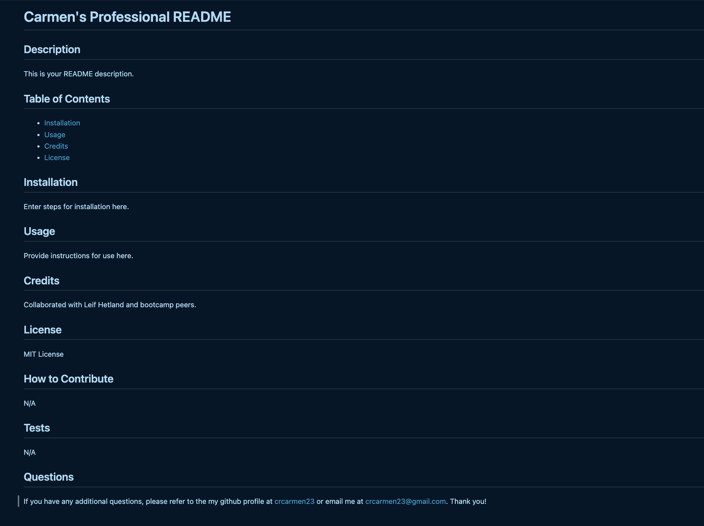

# Professional README Generator

## Description

This application generates a custom professional README file for any new project in a timely manner based on user input when answering a few select questions in the command-line. The application is invoked when the user enters 'node index.js' in their terminal.

The README generated will include a project title and several sections including description, table of contents, installation, usage, license, contributing, tests, and questions.

## Installation

N/A

## Usage

This application could be used to quickly generate a custom and high-quality README file using the command-line. This saves the user time versus having to manually create a README file.

[Link to Video with README Generator walk-through]()

The generated README will look along the lines of this, with user's custom input entered:

## Credits

Collaborated with Leif Hetland, my tutors, and coding bootcamp peers during office hours.

## License

Please refer to the LICENSE in the repo.